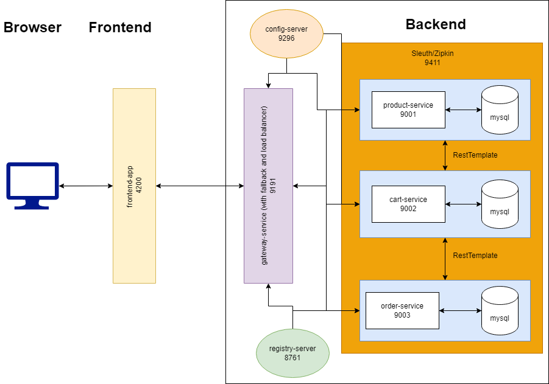

# microservices-pokemon-shop-app

#### Summary

This is a microservices ecommerce application (with limited features) with angular client and backend microservices interacting through a cloud gateway.

###### Features

- There are no users or role.
- You can add products (pokemon cards) by name, price, and image name (case sensitive, lower case pokemon name -> no image if wrong format).
- You can add items to cart from home page, checkout with default address and credit card, and view orders.
- Additionally you can view service log tracing for restTemplate calls in zipkin server on port 9411.

###### Architecture

The registry-server keeps track of and ids all the clients registered with it. This includes the config server, 3 microservices, and gateway.

The config server is hosted on github repo with a yaml file for service registration config for all 5 services.

The gateway is the most important. Not only does it do round robin load balancing on instances of 3 microservices with specified path and hystrix circuit breaker fall back methods, it also allows to access service endpoints with service id for host:port domain when using load balancer rest templates for inter-service communication.

Global cors policy is configured to accept methods, headers, and allowed origin from angular client.

The angular client calls backend endpoints via http client to asynchronously render data in UI view.

###### Notable Dependencies

- Eureka Client
- Eureka Server
- Cloud Config Server
- Cloud Config Client
- Spring Cloud Gateway
- Spring Cloud Load Balancer
- Spring Cloud Bootstrap
- Spring Cloud Sleuth
- Spring Cloud Zipkin
- Spring Web
- Spring Dev Tools
- Lombok
- Spring Cloud Hystrix
- Sping Cloud Circuit Breaker Reactor Resilience 4j
- Spring Cloud Actuator

#### Versions/Installations
- jdk 1.8.0_281
- sts 4.14.1
- mysql 8.0.25
- mysql workbench
- maven 3.8.6
- angular 14.1.3
- node 16.14.2
- npm 8.5.0

#### Required Setup

#### Run
After the prior setup, run the angular app in vs code with command `ng serve`.

Then in STS, run registry-service, config-service, gateway-service, [product-service, cart-service, order-service] as a java app in this order.

You can use postman for testing endpoints and log tracing in Zipkin. To run zipkin jar file enter `java -jar zipkin.jar` in command line.

#### Fail Points and Future Updates

- Hystrix Dashboard wouldn't connect to actuator/hystrix.stream and the data pings also don't mention the endpoint call to a service.

- Zipkin seems to not detect services and their log trace, but sleuth can.

- Will try to use Feign Client to integrate custom http client response handling and fallback methods.

- Adding Hystrix Dashboard or Prometheus with Grafana for service monitoring.

- Spring Cloud Security with OAuth2 and JWT.

- Rabbit MQ as a message Broker for inventory management.

- Further more features in the app.

###### Copyright @ Gaurav Shinde

